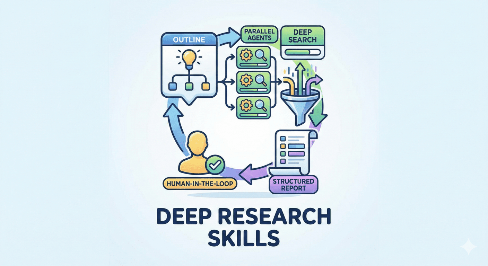

# Ultra Research

> Structured, human-in-the-loop deep research pipeline for Claude Code.

> Inspired by [RhinoInsight: Improving Deep Research through Control Mechanisms for Model Behavior and Context](https://arxiv.org/abs/2511.18743).

Five manually-invoked slash commands form a guided pipeline: build an outline, fan out per-item research, generate a report. Each phase confirms with you before moving on — no surprises, no auto-runs.



## Use Cases

- **Academic Research** — paper surveys, benchmark reviews, literature analysis
- **Technical Research** — technology comparison, framework evaluation, tool selection
- **Market Research** — competitor analysis, industry trends, product comparison
- **Due Diligence** — company research, investment analysis, risk assessment

## Install

```
/plugin marketplace add seanGSISG/claude-depot
/plugin install ultra-research@claude-depot
```

Then install the Python dependency used by the validator and report scripts:

```
pip install pyyaml
```

## Commands

All five skills are **manual-only** (`disable-model-invocation: true`). Claude never auto-triggers them — they fire only when you type the slash command.

| Command | Description |
|---|---|
| `/ultra-research:research <topic>` | Build `outline.yaml` + `fields.yaml` from model knowledge plus one web-search pass |
| `/ultra-research:research-add-items` | Extend the item list in `outline.yaml` |
| `/ultra-research:research-add-fields` | Extend the field list in `fields.yaml` |
| `/ultra-research:research-deep` | Fan out parallel web-search subagents; write per-item JSON to `results/`; resumable |
| `/ultra-research:research-report` | Convert `results/*.json` into a single markdown report via the bundled converter |

## Workflow

The pipeline guides you through each phase with confirmation prompts at natural decision points — you never have to remember which command to run next.

### Phase 1 — Outline

```
/ultra-research:research AI Agent Demo 2025
```

You get an outline of items to research plus a field schema for what to collect about each. At the end, the skill asks **what's next?** — add more items, add more fields, start deep research, or stop.

### Phase 2 — Optional refinement

```
/ultra-research:research-add-items     # add more items
/ultra-research:research-add-fields    # add more fields
```

Iterate as many times as needed. Neither chains forward — you remain in control until you're satisfied with the schema.

### Phase 3 — Deep Research

```
/ultra-research:research-deep
```

Fans out parallel subagents, one per item (configurable concurrency). Each subagent writes a validated JSON file to `results/`. Resumable — re-running skips items that already have a complete JSON.

At the end the skill asks **"Generate the report now?"** — yes, yes with custom TOC fields, or not now.

### Phase 4 — Report

```
/ultra-research:research-report
```

Runs the bundled `generate_report.py`. Asks which fields to summarize in the table of contents, then writes `report.md` to the topic directory.

## Plugin Layout

```
ultra-research/
├── .claude-plugin/plugin.json
├── skills/
│   ├── research/                # Phase 1: outline builder
│   │   ├── SKILL.md
│   │   ├── scripts/validate_json.py
│   │   └── references/prompt-templates.md
│   ├── research-add-items/      # Phase 2a
│   │   └── SKILL.md
│   ├── research-add-fields/     # Phase 2b
│   │   └── SKILL.md
│   ├── research-deep/           # Phase 3: per-item fan-out
│   │   ├── SKILL.md
│   │   └── references/prompt-templates.md
│   └── research-report/         # Phase 4: markdown report
│       ├── SKILL.md
│       ├── scripts/generate_report.py
│       └── references/converter-contract.md
├── agents/
│   └── web-search-agent.md
└── web-search-modules/         # strategy modules loaded by the agent
    ├── academic-papers.md
    ├── english-tech-deepdive.md
    ├── general-web.md
    ├── github-debug.md
    └── stackoverflow.md
```

## Using with OpenCode

The plugin format targets Claude Code. To run the same skills under OpenCode, copy them manually:

```bash
cp -r skills/* ~/.config/opencode/skills/
cp agents/web-search-agent.md ~/.config/opencode/agents/web-search.md
cp -r web-search-modules ~/.config/opencode/agents/
export OPENCODE_ENABLE_EXA=1
```

Without `OPENCODE_ENABLE_EXA=1`, OpenCode falls back to `web fetch`, which is weaker for the deep-research phase. (An OpenCode-flavored agent variant lives upstream at the original [Deep-Research-skills](https://github.com/Weizhena/deep-research-skills) repo.)

## License

MIT
